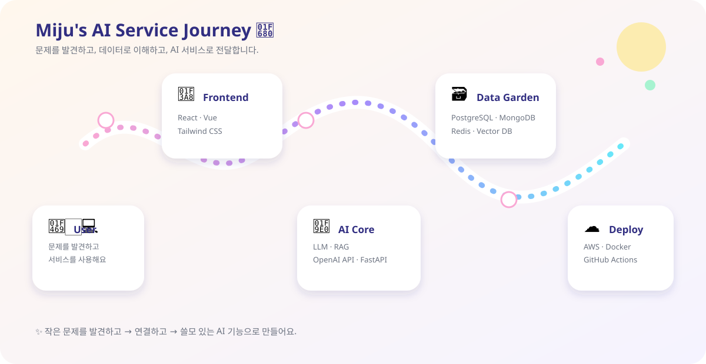

 

<h1>AI Service Developer · Miju Lee</h1>

### 데이터를 연결해 AI 서비스로 가치를 만드는 개발자, 이미주입니다.

데이터 분석부터 사용자 문제 정의와 AI 기능 구현까지, 
기술이 실제로 사용되는 서비스 흐름을 설계하고 개발합니다.

 

 

## About Me

사용자의 문제를 데이터로 이해하고, AI 기술을 실제 기능으로 연결하는 **AI Service Developer**를 지향합니다.

- 흩어진 데이터를 분석 가능한 형태로 정제하고 구조화합니다.
- 사용자 인터뷰와 요구사항 분석을 통해 해결해야 할 문제를 정의합니다.
- RAG, LLM, 이상 탐지 모델을 서비스 기능과 연결하고 사용자 흐름으로 구현합니다.

 

## Tech Stack

**Frontend**

**Backend**

**AI & Data**

**DevOps & Deployment**

 

## Contribution Garden 🐍

<picture>
  <source media="(prefers-color-scheme: dark)" srcset="./dist/github-snake-dark.svg" />
  <source media="(prefers-color-scheme: light)" srcset="./dist/github-snake.svg" />
  
</picture>

## My AI Service Journey 🚀

